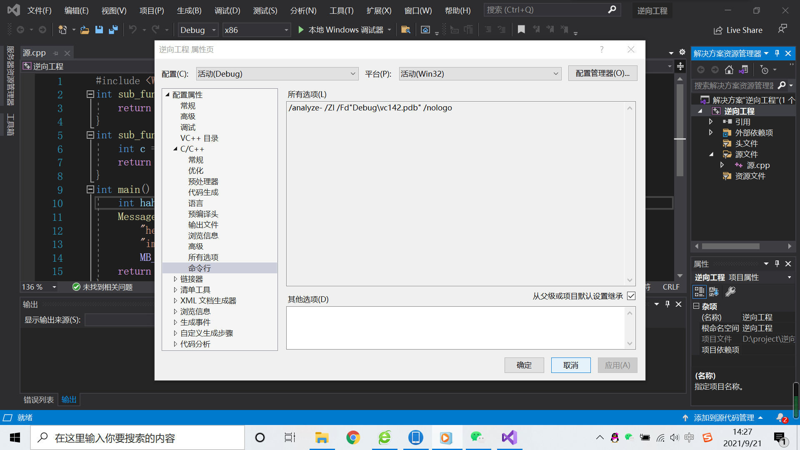
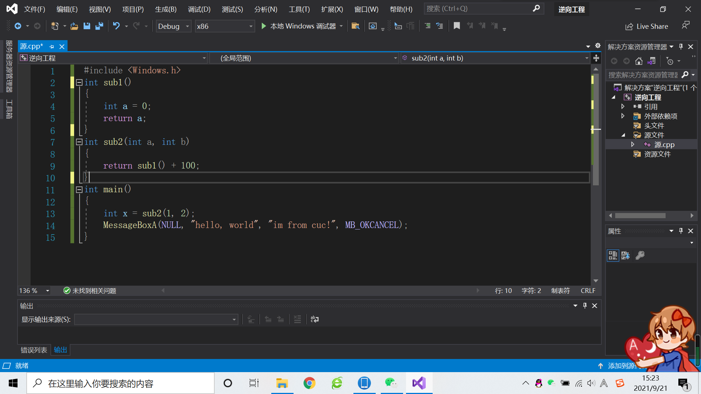
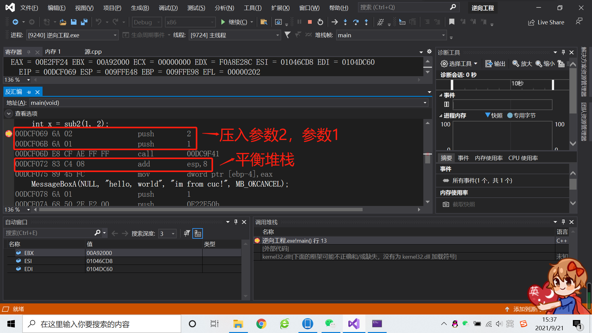

# 2021逆向工程第一次作业
## 实验过程
- 在vs中建立工程，修改编译选项，只保留 /ZI （调试）和pdb文件路径两个选项，增加禁用安全检查选项（/GS-)。
  
- 编译多个函数调用的示例代码。
  
- 下断点调试运行，观察反汇编、寄存器、内存等几个调试时的信息。
  
## 实验结果
- 分析函数调用过程中栈的变化。解释什么是栈帧？ebp寄存器在函数调用过程中的变化过程，ebp寄存器的作用。
  `栈帧就是存储在用户栈上的（当然内核栈同样适用）每一次函数调用涉及的相关信息的记录单元。`
  `ebp 的作用之一就是找到函数的形参，当然栈中的局部变量也是通过 ebp 来定位的，子程序就是通过 ebp + 偏移量 调用主程序传递来的参数的。`
- 函数局部变量和参数的保存位置、访问方式是什么。
  `函数的局部变量、参数和调用返回地址都保持在栈中。通过esp指针进行访问。`
- 多层的函数调用，栈的变化情况，解释未赋初始值的局部变量的值是如何形成的。
  `主程序从右向左将每个参数逐个压入栈,也就是说最后一个参数先入栈;子程序通过 ebp 寄存器访问参数;子程序返回主程序;主程序进行堆栈平衡;主程序取得子程序返回值。未赋初始值的局部变量的值可能来自于内存中该地址中原有的值。`

## 参考链接
- [从汇编角度理解 ebp&esp 寄存器、函数调用过程、函数参数传递以及堆栈平衡](https://blog.csdn.net/song_lee/article/details/105297902)